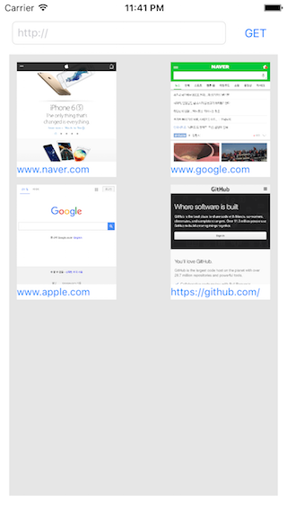

##Webpage Thumbnail

웹페이지 썸네일 이미지를 만들어 준다.



###사용법

```objectivec
@property (strong, nonatomic) WebNailGetter *getter;

self.getter= [[WebNailGetter alloc] init];

[self.getter getImageWithAddress:@"http://www.google.com" //Target URL
                      onComplete:^(NSString *url, UIImage *nail) {
                          //Target URL
                          //Thumbnail Image
                      }];
```

###구현

1. UIWebView 를 하나 생성해서 화면에 안보이게 배치해놓고 (-size,-size)
2. UIWebView 가 화면을 다 그리고 나면 UIImage 로 만들어 준다.

```objectivec
// 1
@property(strong, nonatomic)  UIWebView *webView;

self.webView= [[UIWebView alloc] initWithFrame:CGRectMake(-self.size, -self.size, self.size, self.size)];
self.webView.delegate= self;

UIView *parent= [UIApplication sharedApplication].keyWindow.rootViewController.view;
[parent addSubview:self.webView];

// 2
UIImage *img= [self imageFromView:_webView];

```

###TODO
- 여러번 요청이 겹칠때 쓰레딩 처리
- 웹페이지 그대로 캡춰하지 않고 주요 이미지만 추출해서 생성하기
